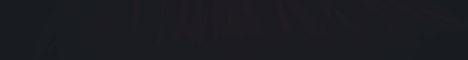

<h1 align="center">Discord Music Bot - Professional</h1>

Thanks for 5k Views on the v1 bot, Enjoy with v2

## Tutorial 
[Click Me](https://www.youtube.com/watch?v=8wopOm4598Q) To watch the video

## Contact Me
 

- Nithish#6593

 

- nithish_codez

## Showcase 

and many more...

## Credits
As always queue system is partially adapted from [@icrawl's](https://github.com/iCrawl) [MusicBotRepo](https://github.com/iCrawl/discord-music-bot)